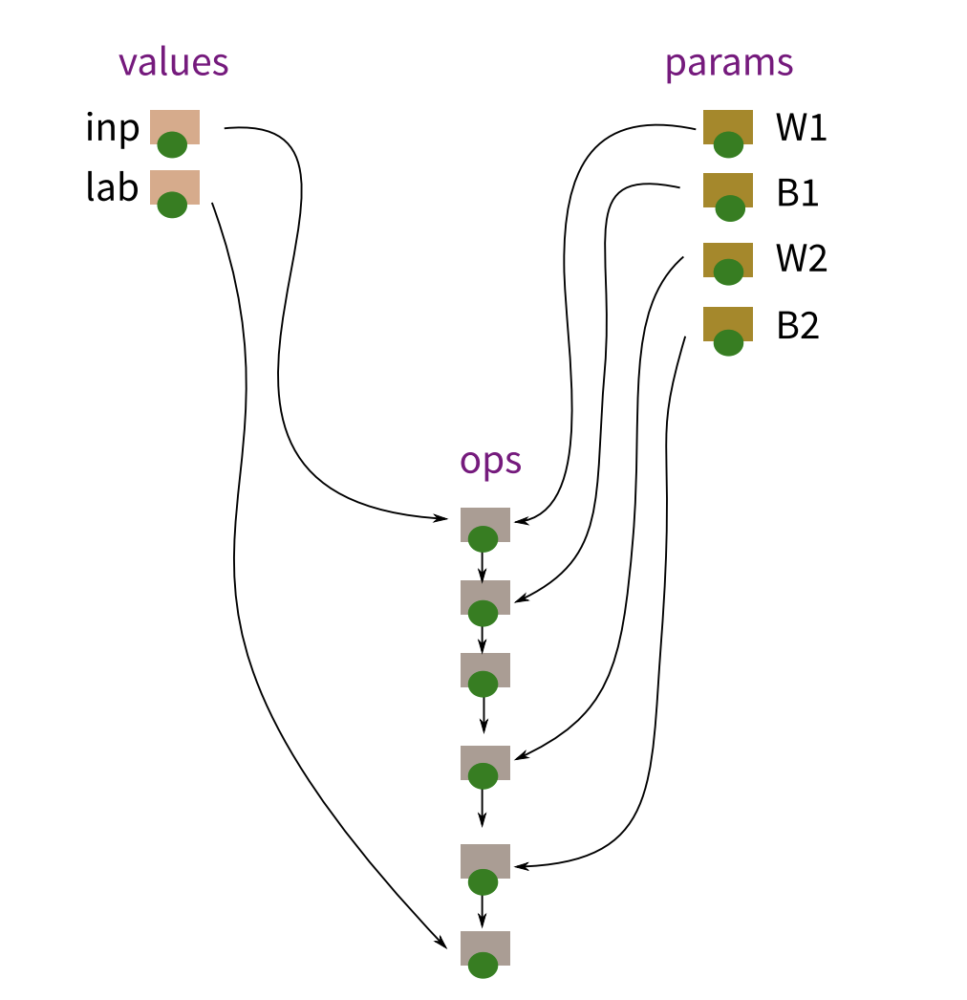

# MiniTorch

<!--  -->
This repository aims to build a **Deep Learning Framework** for (Convolutional) Neural Network from scratch in plain **Numpy**. Unlike many simple neural network implementations manually building matrix computation for each layer and manually computing derivatives for back-propagation, our implementation provides a flexible framework, which mimics how Pytorch/Tensorflow is implemented, to build a neural network effortlessly. The core idea is to build an **Automatic Differentiation Engine** which can compute the derivatives automatically once the forward pass is done. To do that, we take advantage of the **Computation Graph** to tear down the complex neural network into many fundamental operations (e.g., matrix multiplication, convolution, adding, activation, etc). By doing so, the back-propagation can be achieved operation-wise by computing the derivatives for each operation. 
<!--   -->

## Computation Graph

## References
- [Automatic differentiation in PyTorch](https://openreview.net/pdf?id=BJJsrmfCZ)

