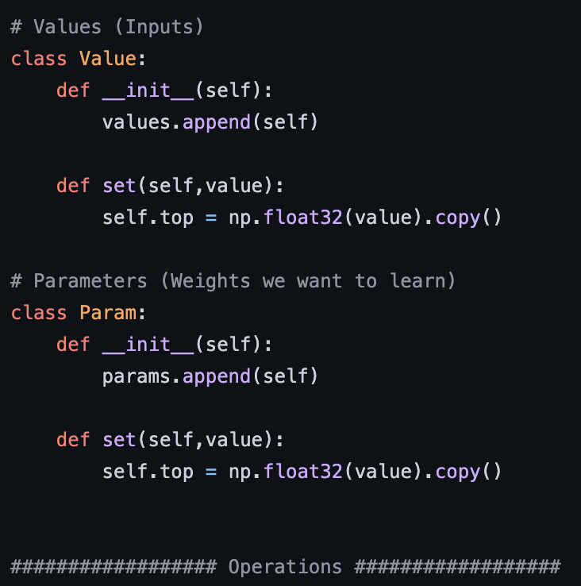
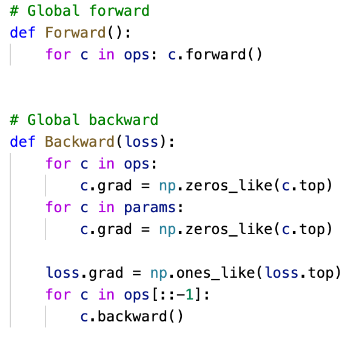
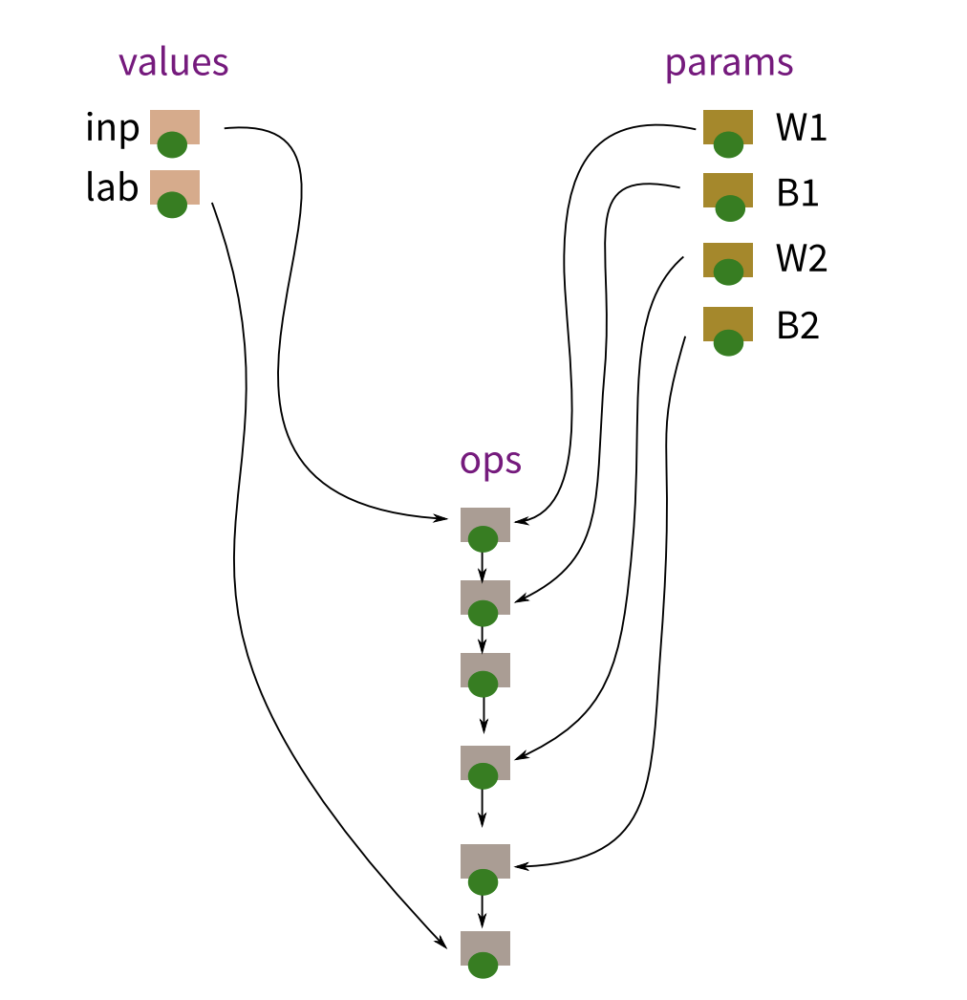

# MiniTorch

This repository aims to build a **Deep Learning Framework** for (Convolutional) Neural Network from scratch in plain **Numpy**. Unlike many simple neural network implementations manually building matrix computation for each layer and manually computing derivatives for back-propagation, our implementation provides a flexible framework, which mimics how Pytorch/Tensorflow is implemented, to build a neural network effortlessly. The core idea is to build an **Automatic Differentiation Engine** which can compute the derivatives automatically once the forward pass is done. To do that, we take advantage of the **Computation Graph** to tear down the complex neural network into many fundamental operations (e.g., matrix multiplication, convolution, adding, activation, etc). By doing so, the back-propagation can be achieved operation-wise by computing the derivatives for each operation. 

### Notice That 
- this is an extremely excellent way to understand how neural networks (also Pytorch/Tensorflow) work (Not everyone has this opportunity) ! 
- This code is for learning purpose and is not allowed to disclose to any unauthorized user !

## Computation Graph
1. Build a direct Computation Graph with a (python) list nodes: G=[n_1, n_2, n_3, ...]
2. Eeah node is an **"Object"** that is one of three kinds:
     - Input
     - Parameter
     - Operation
3. Eech of these statements adds a node to the list nodes
4. Operation nodes are added by matmul, tanh, etc..., and are linked to previous nodes that appears before it in the list as input
 
<!--  -->

     

5. Every node object is going to have a member element n.top which will be the value of its "output" 
   - For input and parameter nodes, these top values will just be set (or updated by SGD)
   - For operation nodes, the top values will be computed from the top values of their inputs
6. In forward, we go through the list of node in order and compute the values of all operation nodes
7. For each "operation" class, we define a function **backward**. All Operation and Parameter nodes will also have an element **grad**
8. In Backward, we go through the list of node in a reverse order and call the **backward** function for each operation node to compute the gradient automatically (We only computes grads for params and ops)

     

9. For each Operation, we only need to specify how **forward** and **backward** is corerctly constructed. 

     

## Code Architecture
1. The Finalized **Automatic Differentiation Engine** is in **Autograd.py** 
2. The **layers.py** is created to wrap higher level layers like Pytorch/Tensorflow
     - e.g., Linear Layer, Convolution Layer, Relu Layer, etc, to ease usage 
     - We also create **Container** like Pytorch/Tensorflow to formulate the Sequential Model
3. **mnist MPL.ipynb** is used to demo a multi-layer feedforward nerural network
4. **mnist ConvNet.ipynb** is used to demo a convolutional nerural network

## References
- [Automatic differentiation in PyTorch](https://openreview.net/pdf?id=BJJsrmfCZ)

