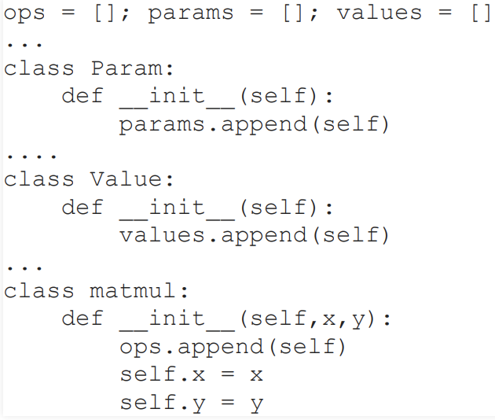
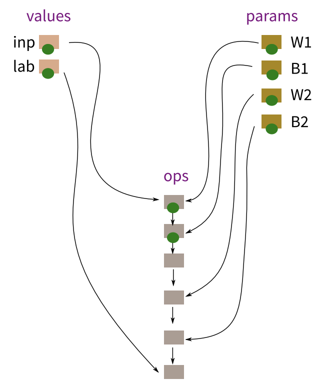

# MiniTorch

This repository aims to build a **Deep Learning Framework** for (Convolutional) Neural Network from scratch in plain **Numpy**. Unlike many simple neural network implementations manually building matrix computation for each layer and manually computing derivatives for back-propagation, our implementation provides a flexible framework, which mimics how Pytorch/Tensorflow is implemented, to build a neural network effortlessly. The core idea is to build an **Automatic Differentiation Engine** which can compute the derivatives automatically once the forward pass is done. To do that, we take advantage of the **Computation Graph** to tear down the complex neural network into many fundamental operations (e.g., matrix multiplication, convolution, adding, activation, etc). By doing so, the back-propagation can be achieved operation-wise by computing the derivatives for each operation. 

### Notice That 
- this is an extremely excellent way to understand how neural networks (also Pytorch/Tensorflow) work (Not everyone has this opportunity) ! 
- This code is for learning purpose and is not allowed to disclose to any unauthorized user !

### Code Architecture(Updated)
1. The code architecture changes a little bit for easier unstanding and usage. And this is almost how **Pytorch** is constructed ! We build a **nn** package for building a neural network ! 
2. The **container.py** contains the basic module of the the **layer.py, loss.py**. For any custom Layer or Loss functions, we can always remake use of the basic functions in Autograd.py. For each time, we only need to rewrite the forward function in **Module** class to customize it.
3. The **layer.py** wraps all the high-level layer that can be called directly, e.g., Linear, Conv2d, Dropout, Relu, etc. We can all easily customize new layers by inheritate **Module** class and overwrite **forward** function only.
4. The **model.py** contains the customized Neural Network based on the layers in **layer.py** 
5. The **autograd.py** contains the basic operations we will use to build the computation graph, e.g., Covn, Matmul, Add, Relu, Dropout, etc. We can even implement more as we need.
6. The **solver.py** contains the optimizers used to optimize the neural network, e.g., vanilla SGD, Momentum, etc. Implementing all kinds of optimizers is very useful for us to understand how neural networks update and converge. 
7. The **loss.py** contains the customized loss function. 
8. The **graph.py** contains the graph we build for the neural network and the session we use to actually run the computation.
9. The **.ipynb** contains the script to run the experiment. 

#### We also provide two demos using Mnist Dataset:1.feedforard neural network(MLP.ipynb); 2.Convolutional neural network(ConvNet.ipynb) !

## To Run The Code (updated)
1. Initialize the graph by instancializing the **Graph** object and calling **as_default()**

     

2. Construct the neural network graph by either using the **Sequential** model, or customizing by you own through inheritaing the **Module** class in the **container.py**. 

     

3. Define the loss function used for training the network and complete the computation graph.

     

4. Initialize the optimizer used to optimize the parameters in the network

     

5. Open a new **Session** to run the actual computation by feeding the inputs, and call **optimizer.step()** to update the parameters.

     

## Computation Graph
1. Build a direct Computation Graph with a (python) list nodes: G=[n_1, n_2, n_3, ...]
2. Eeah node is an **"Object"** that is one of three kinds:
     - Input
     - Parameter
     - Operation
3. Eech of these statements adds a node to the list nodes
4. Operation nodes are added by matmul, tanh, etc..., and are linked to previous nodes that appears before it in the list as input
 
<!--  -->

     

5. Every node object is going to have a member element n.top which will be the value of its "output" 
   - For input and parameter nodes, these top values will just be set (or updated by SGD)
   - For operation nodes, the top values will be computed from the top values of their inputs
6. In forward, we go through the list of node in order and compute the values of all operation nodes
7. For each "operation" class, we define a function **backward**. All Operation and Parameter nodes will also have an element **grad**
8. In Backward, we go through the list of node in a reverse order and call the **backward** function for each operation node to compute the gradient automatically (We only computes grads for params and ops)

     

9. For each Operation, we only need to specify how **forward** and **backward** is corerctly constructed. 

     

## References
- [Automatic differentiation in PyTorch](https://openreview.net/pdf?id=BJJsrmfCZ)
- [Stanford CS231n](https://cs231n.github.io/)

